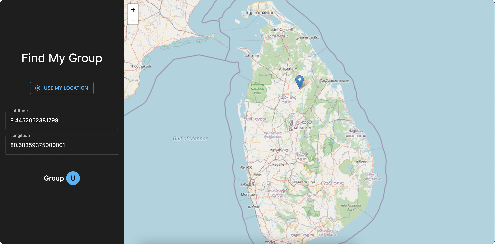

# Find My CEB Group

## About The Project

In Sri Lanka, the Ceylon Electricity Board (CEB) handles the electricity supply for the whole country. They have grouped various areas in SL according to the letters of the English alphabet. Using this people of a particular group can find out if they will experience a power outage.

However, many people have difficulties in identifying which group they belong to. This tool attempts to solve that problem by using geolocation to easily find the user's group.

### Built with

This project is built with NextJS and Material UI

## Demo

A live demo of this project can be found at [https://find-my-ceb-group.vercel.app/](https://find-my-ceb-group.vercel.app/)

## Usage

Click on the `USE MY LOCATION` button and allow location access so the tool can use your current coordinates to find your group.

Or, click on parts of the map to find the respective group.

### Screenshots

## Known Issues

Since some group zones overlap each other, the tool currently will suggest a list of possible groups based on the given location. This can probably be solved by getting feedback from a large number of users of their location and actual group, and updating the group zones accordingly.

## Acknowledgments

Data scraped from [Demand Managemnt Schedule](https://cebcare.ceb.lk/Incognito/DemandMgmtSchedule) app developed by CEB
